# 📘 TNI SYSTEM USAGE GUIDE — HƯỚNG DẪN SỬ DỤNG HỆ THỐNG TOÀN DIỆN

> [!IMPORTANT]
> **Living Document** — Mỗi khi thêm tính năng/bot/tác vụ mới, BẮT BUỘC cập nhật hướng dẫn này lên BI Sheet.
> Last Updated: 31/08/2026

---

## 🗺️ 1. BỨC TRANH TỔNG QUAN HỆ THỐNG (System Overview)

```mermaid
graph TD
    subgraph "👥 NHÓM TELEGRAM"
        T1["🟦 TNI TEAM 1<br/>Dawei (22 thành viên)"]
        T2["🟧 TNI TEAM 2<br/>Myeik + Team5"]
        T3["🟩 TNI TEAM 3<br/>Bokpyin"]
        T4["🟪 TNI TEAM 4<br/>Kawthoung"]
        CTRL["🔴 CONTROL<br/>5 TNI TECHNICA DEP"]
        CABLE["🔌 Cable Group"]
        REFUEL["⛽ Refuel Group 9"]
        CONS["🏗️ T1-T4 Construction"]
    end

    subgraph "🤖 BOT HỆ THỐNG"
        SEARCH["🔍 Search Bot<br/>@SEARCHTNITASKWOBOT"]
        ASSET["📦 Asset Collector<br/>@TNIASSETorderREQUEST_BOT"]
        SITEDOWN["📡 Site Down Bot<br/>@tni_site_down_bot"]
        SOLUTION["📋 Solution Bot<br/>@TNICLEARSITEBOT"]
        ATTEND["👤 Attendance Bot"]
        CONSTRUCT["🏗️ Construction Bot"]
        REFUELBOT["⛽ Refuel Bot"]
    end

    subgraph "☁️ HẠ TẦNG"
        GAS["Google Apps Script<br/>(6 dự án GAS)"]
        SHEET["Google Sheets<br/>(3 bảng tính chính)"]
        GHA["GitHub Actions<br/>(Đoàn tàu 5 phút)"]
        VERCEL["Vercel<br/>(API Endpoints)"]
        BI["📊 BI Portal<br/>(Web Dashboard)"]
    end

    T1 & T2 & T3 & T4 --> SEARCH
    T1 & T2 & T3 & T4 --> ASSET
    T1 & T2 & T3 & T4 --> SOLUTION
    CTRL --> SEARCH
    SITEDOWN --> T1 & T2 & T3 & T4 & CTRL
    GHA --> GAS --> SHEET
    VERCEL --> SEARCH & ASSET
    GAS --> BI
```



---

## 👥 2. AI DÙNG GÌ? — PHÂN QUYỀN THEO NHÓM

### 🟦 Nhóm T1 / T2 / T3 / T4 (Nhân viên kỹ thuật hiện trường)

| Tác vụ | Bot | Cú pháp / Hành động | Ví dụ |
|---|---|---|---|
| **Tra cứu trạm** | @SEARCHTNITASKWOBOT | Gõ mã trạm TNIxxxx | `TNI0394` |
| **Xem thông tin đầy đủ** | @SEARCHTNITASKWOBOT | `Info: TNIxxxx` | `Info: TNI0394` |
| **Báo cáo Order/Revoke/Export** | @TNIASSETorderREQUEST_BOT | Gõ từ khóa đầu dòng | `Order SC/path cord 10m` |
| **Gửi ảnh đính kèm** | @TNIASSETorderREQUEST_BOT | Reply ảnh vào tin xác nhận | Reply photo |
| **Điền Solution sự cố** | @TNICLEARSITEBOT | `TNIxxxx Solution: [mô tả]` | `TNI0417 Solution: replace fuse` |
| **Xem template Solution** | @TNICLEARSITEBOT | Gõ lệnh `/sol_ten_nhan_vien` | `/sol_aung_la_pyae_oo` |
| **Nộp Plan ngày** | @SEARCHTNITASKWOBOT | Gõ `/plan` hoặc dùng template | `/plan` |
| **Điểm danh** | Attendance Bot | `/attendance` hoặc gửi ảnh selfie | `/attendance` |
| **Báo cáo thi công** | Construction Bot | `Pro TNIxxxx` hoặc gửi ảnh | `Pro TNI0394` |

### 🔴 Nhóm CONTROL (Quản lý vận hành)

| Tác vụ | Bot | Cú pháp | Mô tả |
|---|---|---|---|
| **Xem tổng hợp tất cả Team** | Tự động | — | Nhận Reports 1-6 tổng hợp |
| **Tra cứu trạm** | @SEARCHTNITASKWOBOT | `TNI0394` hoặc `Info: TNI0394` | Xem chi tiết trạm |
| **Xem trạm chưa close** | @SEARCHTNITASKWOBOT | `/t1notclose` | Liệt kê WO chưa đóng |
| **Xem WO chờ duyệt** | @SEARCHTNITASKWOBOT | `/t1waitcd` | Liệt kê WO chờ Close Date |
| **Refresh danh sách sự cố** | @TNICLEARSITEBOT | `/refresh` | Cập nhật lại tin Site Clear |
| **Xem DM cá nhân** | @tni_site_down_bot | — | BOD nhận tin Site Down riêng |

### ⛽ Nhóm Refuel Group 9

| Tác vụ | Bot | Cú pháp | Ví dụ |
|---|---|---|---|
| **Gửi kế hoạch refuel** | Refuel Bot | Theo template | `Team 2: TNI0385=220L, TNI0394=440L` |
| **Xem báo cáo Refuel Plan** | Tự động | — | Nhận Reports Refuel 1, 2, 4 |

### 🔌 Nhóm Cable

| Tác vụ | Bot | Cú pháp | Ví dụ |
|---|---|---|---|
| **Xem báo cáo Cable hàng ngày** | Tự động | — | Nhận Cable Daily Report |

### 🏗️ Nhóm Construction T1-T4

| Tác vụ | Bot | Cú pháp | Ví dụ |
|---|---|---|---|
| **Báo nhận vật tư** | Construction Bot | `/team_received_material` | Gửi kèm ảnh |
| **Cập nhật tiến độ** | Construction Bot | `Pro TNIxxxx` | `Pro TNI0394` |

---

## 🤖 3. DANH SÁCH BOT & LỆNH ĐẦY ĐỦ

### 🔍 Bot 1: Search Bot (`@SEARCHTNITASKWOBOT`)
**Nhóm nhận**: T1, T2, T3, T4, CONTROL

| Lệnh / Cú pháp | Chức năng | Ghi chú |
|---|---|---|
| `TNIxxxx` | Tra cứu Task & WO nhanh | Chỉ gõ đúng mã, KHÔNG thêm text |
| `Info: TNIxxxx` | Tra cứu đầy đủ Site Info | Có thêm thông tin chi tiết |
| `/t1notclose` ... `/t4notclose` | Liệt kê WO chưa Close theo Team | |
| `/t1waitcd` ... `/t4waitcd` | Liệt kê WO chờ Close Date | |
| `/mydata` | Xem data của mình | Theo Telegram ID |
| `/plan` | Nhập kế hoạch ngày | Template Plan |
| `/help` | Xem trợ giúp | |

### 📦 Bot 2: Asset Collector (`@TNIASSETorderREQUEST_BOT`)
**Nhóm nhận**: T1, T2, T3, T4, CONTROL

| Từ khóa (đầu dòng) | Chức năng | Template |
|---|---|---|
| `Order` | Đặt hàng vật tư | `Order SC/path cord 10m` |
| `Order:` | Đặt hàng (có dấu :) | `Order: Battery 12V` |
| `Revoke` | Thu hồi vật tư | `Revoke SC/path cord 5m TNI0394` |
| `Export` | Xuất vật tư | `Export Battery 12V to TNI0401` |
| `Move` | Di chuyển thiết bị | `Move RRU from TNI0394 to TNI0401` |
| `Destroys` | Hủy thiết bị | `Destroys Battery 12V (expired)` |
| `Loss fuel` | Mất/hao dầu | `Loss fuel 20L TNI0394` |
| `Inventory oil` | Kiểm kê dầu | `Inventory oil TNI0394 = 200L` |
| `Inventory water coolant` | Kiểm kê nước làm mát | `Inventory water coolant 50L` |
| `Vcm order to Mytel` | Đặt VCM Mytel | `Vcm order to Mytel TNI0394` |

> [!TIP]
> **Gửi ảnh kèm**: Sau khi bot xác nhận `✅`, Reply ảnh vào tin xác nhận đó để đính kèm.

### 📡 Bot 3: Site Down Bot (`@tni_site_down_bot`)
**Nhóm nhận**: T1, T2, T3, T4, CONTROL, DM cá nhân BOD

| Tin tự động | Mô tả | Thời gian |
|---|---|---|
| **Tin 1 — Chi tiết trạm sập** | Danh sách từng trạm đang sập theo Team | Mỗi 30 phút (:06 & :36 MMT) |
| **Tin 2 — SUMMARY tổng hợp** | Ma trận tổng hợp AW7:AZ15 | Khi có dữ liệu mới (AW7 đổi) |

> [!NOTE]
> Bot tự bỏ qua dữ liệu cũ hơn **30 phút** so với hiện tại (tránh gửi data đêm vào sáng).

### 📋 Bot 4: Solution Clear Bot (`@TNICLEARSITEBOT`)
**Nhóm nhận**: T1, T2, T3, T4, CONTROL

| Lệnh / Cú pháp | Chức năng |
|---|---|
| `/sol_ten_nhan_vien` | Xem template các trạm cần điền Solution |
| `/menu` | Đồng bộ lại menu Solution cho Team |
| `/refresh` | Cập nhật danh sách Site Clear |
| `TNIxxxx Solution: [mô tả]` | Gửi Solution cho 1 trạm |
| `TNIxxxx: [mô tả]` | Gửi Solution (cú pháp cũ, vẫn hoạt động) |

**Ví dụ gửi Solution nhiều trạm cùng lúc**:
```
TNI0417 Solution: replace fuse box
TNI0426 Solution: generator repair done
TNI0385 Solution: battery replaced
```

### 👤 Bot 5: Attendance Bot
**Nhóm nhận**: T1, T2, T3, T4

| Lệnh | Chức năng |
|---|---|
| `/attendance` | Mở form điểm danh |
| Gửi ảnh selfie | Tự nhận diện khuôn mặt & điểm danh |

### 🏗️ Bot 6: Construction Bot (`@8903841312`)
**Nhóm nhận**: T1-T4 Construction

| Lệnh | Chức năng |
|---|---|
| `Pro TNIxxxx` | Báo tiến độ thi công |
| `/team_received_material` | Xác nhận nhận vật tư |
| Gửi ảnh | Lưu ảnh tiến độ lên Google Drive |

### ⛽ Bot 7: Refuel Bot
**Nhóm nhận**: Refuel Group 9

| Lệnh | Chức năng |
|---|---|
| Gửi theo template | Kế hoạch cấp dầu (`Team X: TNIxxxx=YYL`) |

---

## 📊 4. BÁO CÁO TỰ ĐỘNG — LỊCH GỬI HÀNG NGÀY

### ☀️ Ca Sáng (05:00 - 10:00 MMT)

| Giờ | Báo cáo | Nhóm nhận | Nội dung |
|---|---|---|---|
| **05:46** | Reports 1, 2, 3 + BOD | T1-T4, CONTROL | Task & WO Backlog |
| **05:51** | Report 4 — EOD Task & Stats | T1-T4, CONTROL | Thống kê kết ca |
| **05:56** | Cable Daily Report | Cable Group | Báo cáo cáp hàng ngày |
| **06:06** | Report 5C — Plan Morning | T1-T4, CONTROL | Kế hoạch ngày |
| **07:18** | Report 6.1 — Site Clear Today | T1-T4, CONTROL | Trạm đã Clear hôm nay |
| **08:28** | Report 5C — Plan Morning | T1-T4, CONTROL | Cập nhật Plan |
| **08:48** | Report 6 — Note Read (Ca 1) | T1-T4, CONTROL | Ai đã đọc Note |

### 🌤️ Ca Chiều (13:00 - 16:30 MMT)

| Giờ | Báo cáo | Nhóm nhận | Nội dung |
|---|---|---|---|
| **13:06** | Refuel Request | Refuel Group | Yêu cầu cấp dầu |
| **13:11** | Refuel Plan Combined | Refuel Group | Kế hoạch refuel tổng hợp |
| **14:18** | Report 6.1 — Site Clear Today | T1-T4, CONTROL | Trạm đã Clear |
| **14:58** | Report 6 — Note Read (Ca 2) | T1-T4, CONTROL | Ai đã đọc Note |
| **15:26** | Report 5C — Plan Evening | T1-T4, CONTROL | Cập nhật Plan chiều |
| **15:46** | Reports 1, 2, 3 + BOD | T1-T4, CONTROL | Task & WO cập nhật |
| **15:51** | Report 4 — EOD Task | T1-T4, CONTROL | Thống kê kết ca |
| **15:56** | Cable Daily Report | Cable Group | Báo cáo cáp chiều |

### 🌙 Ca Tối (17:00 - 22:30 MMT)

| Giờ | Báo cáo | Nhóm nhận | Nội dung |
|---|---|---|---|
| **17:18** | Report 6 + 6.1 | T1-T4, CONTROL | Read + Site Clear |
| **18:06** | Refuel Plan | Refuel Group | Kế hoạch refuel |
| **18:41** | Report 5A — Plan EOD | T1-T4, CONTROL | Kế hoạch cuối ngày |
| **19:11** | Report 5B — Plan Update | T1-T4, CONTROL | Cập nhật Plan tối |
| **19:41** | Report 6 — Note Read (Ca 3) | T1-T4, CONTROL | Ai đã đọc Note |
| **21:36** | Refuel Plan + Members | Refuel Group | Refuel + Thành viên |
| **22:06** | Report 5C — Plan Evening | T1-T4, CONTROL | Cập nhật Plan cuối |

### 🔄 Chạy liên tục (Suốt ngày 03:30 - 22:10 MMT)

| Chu kỳ | Tác vụ | Nhóm nhận |
|---|---|---|
| Mỗi 30 phút (:06 & :36) | Site Down Detail (Tin 1) | T1-T4, CONTROL, DM BOD |
| Khi AW7 đổi giờ | Site Down Summary (Tin 2) | T1-T4, CONTROL, DM BOD |
| Mỗi 5 phút | Keepalive Ping all endpoints | Không gửi — chỉ giữ ấm server |

---

## 📋 5. TEMPLATE THU THẬP — HƯỚNG DẪN GÕ ĐÚNG

### Template 1: Order vật tư
```
Order SC/path cord 10m
Order: Battery 12V x2 for TNI0394
```

### Template 2: Revoke vật tư
```
Revoke SC/path cord 5m from TNI0394
```

### Template 3: Solution sự cố
```
TNI0417 Solution: replace fuse box, power restored
TNI0426 Solution: generator repair completed
```

### Template 4: Plan ngày (qua Search Bot)
```
/plan
→ Bot hiện template → Điền vào
```

### Template 5: Refuel Plan (qua Refuel Group)
```
Team 2: TNI0385=220L, TNI0394=440L
```

### Template 6: Construction Progress
```
Pro TNI0394
→ Gửi kèm ảnh tiến độ
```

---

## 🔧 6. DÀNH CHO NGƯỜI MỚI — BẮT ĐẦU TỪ ĐÂU?

### Bước 1: Tham gia đúng nhóm Telegram
- Nhóm Team của mình (T1/T2/T3/T4) — **BẮT BUỘC**
- Nhóm Construction Team (nếu liên quan thi công)
- Nhóm Refuel Group 9 (nếu quản lý refuel)
- Nhóm Cable (nếu liên quan cáp)

### Bước 2: Khởi tạo Bot
- Gửi tin nhắn `/start` cho mỗi bot trong nhóm để bot nhận diện bạn
- Thử gõ `TNI0001` để test Search Bot

### Bước 3: Nắm 5 tác vụ hàng ngày
1. **Sáng**: Xem Plan (`/plan`) → Kiểm tra WO
2. **Suốt ngày**: Tra cứu trạm (`TNIxxxx`) → Báo cáo Asset
3. **Khi có sự cố clear**: Điền Solution (`TNIxxxx Solution: ...`)
4. **Cuối ngày**: Đọc Note EOD → Bot tự tracking ai đã đọc
5. **Khi cần**: Gõ `/help` để xem trợ giúp

### Bước 4: Đọc báo cáo tự động
- Báo cáo tự gửi vào nhóm theo lịch (xem Mục 4)
- Không cần làm gì — chỉ cần **ĐỌC** Note EOD hàng ngày

---

## 📊 7. GOOGLE SHEETS — 3 BẢNG TÍNH CHÍNH

| Bảng tính | Chức năng | Tab quan trọng |
|---|---|---|
| **Team All Find** | Dashboard chính, tra cứu, thống kê | Task remain, Search Log, Read Group, Config |
| **Site Down Sheet** | Dữ liệu trạm sập (bot tự ghi) | Input Site down Telegram |
| **Attendance Sheet** | Điểm danh nhân sự | List Attendance |

---

## 🧹 8. BẢO TRÌ TỰ ĐỘNG

| Tác vụ | Chu kỳ | Mô tả |
|---|---|---|
| **Cleanup Read Group** | Ngày 16 hàng tháng ~01:00 | Xóa dữ liệu lượt đọc cũ > 45 ngày |
| **Keepalive Ping** | Mỗi 5 phút | Giữ ấm server Vercel, GAS |
| **Auto Copy & Delete** | Mỗi 15 phút | Đồng bộ 27 rule giữa các Sheet |
| **Site Down Relay** | Mỗi 30 phút | Cào dữ liệu trạm sập từ NOC Pro |

---

## 📌 9. QUY TẮC BẮT BUỘC — KHI THÊM TÍNH NĂNG MỚI

> [!CAUTION]
> **Mỗi khi thêm bot/lệnh/báo cáo/tác vụ mới, BẮT BUỘC cập nhật các mục sau:**

1. ✅ Thêm hàng mới vào **Mục 2** (Ai dùng gì?)
2. ✅ Thêm lệnh mới vào **Mục 3** (Danh sách Bot & Lệnh)
3. ✅ Thêm lịch gửi vào **Mục 4** (Lịch Báo cáo) nếu là report tự động
4. ✅ Thêm template vào **Mục 5** (Template Thu thập)
5. ✅ Cập nhật `system_map.md` — Bảng Train Manifest
6. ✅ Cập nhật `AGENTS.md` — Bảng Webhook nếu có Bot/Endpoint mới
7. ✅ Đánh dấu **Last Updated** ở đầu trang

### Mẫu khai báo tính năng mới:
```
| [Tên tác vụ] | [Bot nào] | [Cú pháp] | [Ví dụ] |
```

---

## 🏛️ 10. KIẾN TRÚC KỸ THUẬT (Dành cho Admin/Developer)

### 6 Dự án GAS độc lập

| # | Tên | Ghế | Chức năng |
|---|---|---|---|
| 1 | TNI (QLTC_GAS) | GAS-OPS-1 | Vận hành chung (17 files) |
| 2 | TNI Site Down Bot | GAS-SITEDOWN-2 | Site Down Relay (Khóa Thép 🔒) |
| 3 | TNI Attendance Bot | GAS-ATTENDANCE-4 | Điểm danh nhân sự |
| 4 | TC | GAS-CONSTRUCTION-3 | Tài chính & Tiến độ |
| 5 | TNI BI Portal | GAS-BI-5 | Backend BI Portal |
| 6 | TNI Solution Clear | GAS-SOLUTION-CLEAR-6 | Thu thập Solution |

### 3 Repository GitHub

| Repo | Chức năng | Push khi nào |
|---|---|---|
| `phonghdpxd-cmd/tni-bot` | Vercel API (Search, Collector) | Sửa file `api/*.py` |
| `MON6879/tni-sitedown-relay` | GitHub Actions (Reports, Relay) | Sửa reports, workflows |
| `MON6879/TNI-DONE` | Web BI Portal, docs | Sửa BI dashboard |

---

> **Tài liệu này được tạo bởi hệ thống TNI Automation. Cập nhật lần cuối: 31/08/2026 06:37 MMT.**
